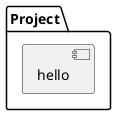
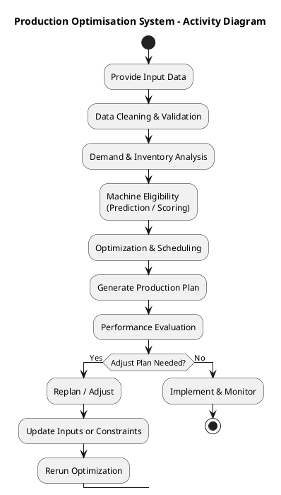

# Project design

Describe the design of your project: its structure, what each component 
is responsible for, how the components interact, and how they work. Also describe the data required and the output that is generated.

UML diagrams provided in a `plantuml` block are automatically rendered when the
documentation is built. You can find the PlantUML documentation [here](https://plantuml.com/).

## Components

This package has one component named `hello` which provides a function `hello()`.

## Behaviour

The `hello()` function prints "Hello World".

