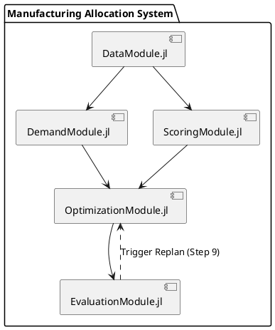
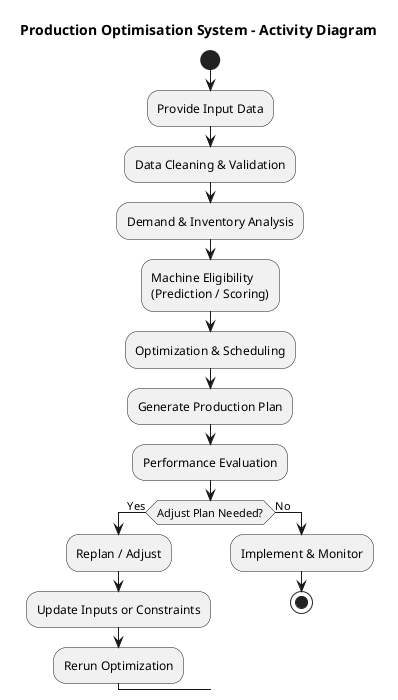

# Project design

This document describes the design of the Manufacturing Order-to-Machine Allocation project, including its structure, component responsibilities, system interactions, required data, and generated outputs. The system successfully maps a complex 10-step industrial workflow into 5 cohesive software modules.   

## Components

The system is structured into five distinct Julia modules. Each module is responsible for specific steps of the allocation workflow:
  DataModule.jl: Responsible for Data Loading (Step 1) and Data Cleaning & Validation (Step 2). It handles raw data ingestion, standardizes formats, and validates consistency.
  DemandModule.jl: Executes Demand & Inventory Analysis (Step 3). It calculates required quantities based on demand and safety stock.
  ScoringModule.jl: Manages Machine Eligibility (Step 4) and Prediction / Scoring (Step 5). It identifies feasible order-machine combinations and scores them based on historical performance.
  OptimizationModule.jl: The core mathematical engine handling Optimization & Scheduling (Step 6) and Replan / Adjust logic (Step 9). It uses Mixed Integer Linear Programming (MILP) to assign orders to machines and recalculates schedules when constraints change.
  EvaluationModule.jl: Manages Output Production Plan (Step 7), Warehouse & Performance Evaluation (Step 8), and Implement & Monitor (Step 10). It exports the plan and evaluates KPIs.

## System Workflow
The components interact sequentially to process the data, utilizing a parallel branch for eligibility and scoring, followed by an evaluation loop.
DataModule.jl ingests and validates the data, passing it to both DemandModule.jl (for inventory analysis) and ScoringModule.jl (for machine filtering). The outputs from both modules converge into OptimizationModule.jl, which mathematically schedules the orders. Finally, EvaluationModule.jl assesses the resulting plan. If targets are not achieved, a replanning trigger is sent back to OptimizationModule.jl to adjust constraints and rerun the optimization algorithm.

## Data and Output

Required Data (Inputs):
  The system requires four primary categories of input data loaded by the DataModule.jl:   
    Orders: Includes demand, due dates, and required quantities.   
    Product/BOM: Contains process times and routing information.   
    Machine Data: Specifies capacity, availability, and machine capabilities.   
    Inventory Data: Details current stock levels and safety stock requirements.   

Generated Output:
  The final output generated by the system is a detailed Production Plan. This output maps specific scheduling assignments, including:   
    Order ID linked to the Assigned Machine.   
    Production Quantity alongside calculated Start and Finish Times.   
    Expected Completion status accompanied by a Reason or Score. 
